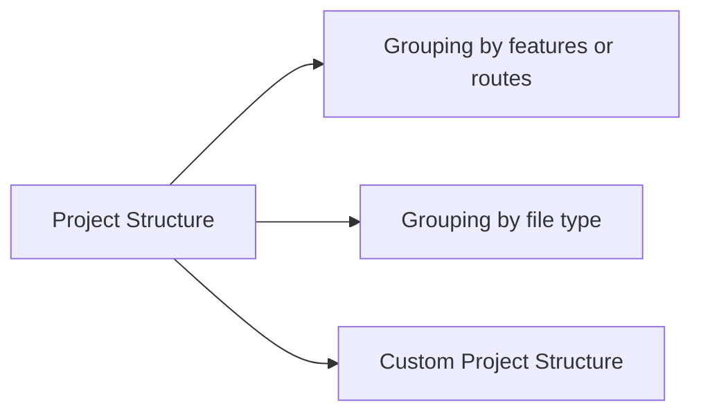

<link rel="stylesheet" href="../../stylesheets/extra.css" />
<link rel="preconnect" href="https://fonts.googleapis.com">
<link rel="preconnect" href="https://fonts.gstatic.com" crossorigin>
<link href="https://fonts.googleapis.com/css2?family=Scope+One&display=swap" rel="stylesheet">

## Overview
Having a clear project structure is essential to collaborate on a web application. Also, it is important as it helps developers create new files following the existing conventions and helps them edit the existing files.

!!! warning
    Do not run these commands if you already have a project structure


!!! info
    This page is a reference page for developers. We have already created the app on installing react calendar page.


We can create a new react application using the following command

```
npx create-react-app calendar
```
React provide a solid structure to work upon. The default file structure after creating a new react application would look like the below:

```
calendar
├── package.json
├── public
│   ├── favicon.ico
│   ├── index.html
│   ├── logo192.png
│   ├── logo512.png
│   ├── manifest.json
│   └── robots.txt
├── README.md
└── src
    ├── App.css
    ├── App.js
    ├── App.test.js
    ├── index.css
    ├── index.js
    ├── logo.svg
    ├── reportWebVitals.js
    └── setupTests.js
```

Here are a few ways to struture a react application.



## Grouping by features or routes

We can see in the project tree below that all the files are separated based on the feature or route.
The example below shows three different routes for the application: common, feed, and profile. So the files are separated based on the route they belong to.


```
common/
  Avatar.js
  Avatar.css
  APIUtils.js
  APIUtils.test.js
feed/
  index.js
  Feed.js
  Feed.css
  FeedStory.js
  FeedStory.test.js
  FeedAPI.js
profile/
  index.js
  Profile.js
  ProfileHeader.js
  ProfileHeader.css
  ProfileAPI.js

```

## Grouping by file type

In the project tree below, we can spot that the files interacting with API are in a different directory, and the files for components are in a separate folders.

```
api/
  APIUtils.js
  APIUtils.test.js
  ProfileAPI.js
  UserAPI.js
components/
  Avatar.js
  Avatar.css
  Feed.js
  Feed.css
  FeedStory.js
  FeedStory.test.js
  Profile.js
  ProfileHeader.js
  ProfileHeader.css
```
## Creating a custom project structure
React allows developers to create a custom project structure, allowing them to structure their code
as they wish. However, it is recommended to have minimal folder nesting while structuring your code.

List of some useful commands to help you create a custom project structure.

Create a new directory test

> mkdir test

Change directory

> cd test

Create a new javascript file

> touch calendar.js

Opening file in Visual Studio Code

> code calendar.js


## Conclusion
!!! success
    By the end of this section, you will have successfully learned the following:

    -  Why project structure is important
    -  Different styles of project structures
    -  How to customize the project structure


