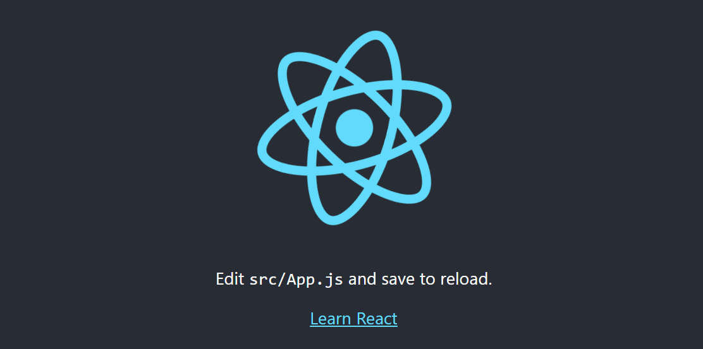

<link rel="stylesheet" href="../../stylesheets/extra.css" />

## Overview
In this section I will walk you through the installation of [React Calendar](https://www.npmjs.com/package/react-calendar) which involves creating a new project directory, installing [React 16.3](https://react.dev/) or later, and importing the Calendar component in the App.js file. 

## Installation Steps for React Calendar

!!! warning
    As for [Compatibility](https://github.com/wojtekmaj/react-calendar#compatibility), your project needs to use [React 16.3](https://react.dev/) or later.

[React Calendar](https://www.npmjs.com/package/react-calendar) uses modern web technologies. That's why it's so fast, lightweight and easy to style. This, however, comes at a cost of supporting only modern browsers.
 
 
1. Create a new project directory
  > npx create-react-app my-app
2. In Visual Studio Code, open your desired terminal in your current project directory
  > cd my-app
3. Run the following commands in order:
  > npm start
4. To install react-calendar
  > npm install react-calendar


4. In `my-app/src/App.js` import react-calendar
```js
import Calendar from 'react-calendar'
```
5. return the Calendar component in your App function
```js
return (
    <Calendar />
  );
```

Example of `/App.js` file:
```js
import './App.css';
import Calendar from 'react-calendar'

function App() {
  return (
    <Calendar />
  );
}

export default App;
```

Everything you need to access/manipulate with React Calendar is going to be found on the Calendar Components props. You can find more about the interactivity and customization of your calendar here: <a href='../eventlistener/'>Event Listeners</a>, <a href='../styling/'>Styling</a>


## Conclusion

<!-- !!! warning
    Specifies content that must be read before proceeding.

!!! Info
    Indicates additional information or tips. -->

!!! success
    Indicates what success looks like.

  You should now have a working React Calendar in your React Application. Great work!