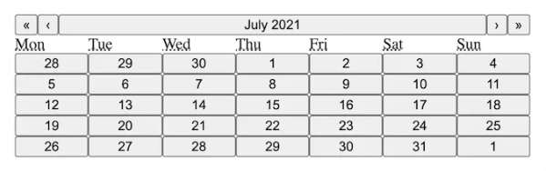
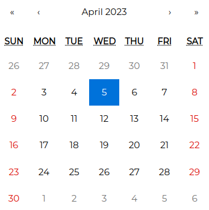

<link rel="stylesheet" href="../../stylesheets/extra.css" />

## Overview
[React Calendar](https://www.npmjs.com/package/react-calendar) is fully open-source providing flexibility to all developers to use the calendar as they choose. As for the overall appearance of your calendar, we recommend importing our default css stylesheet and tweak accordingly as this calendar component was meant to handle the javascript logic for you.

The first image shows what it will look like after setting up.

The second image shows the Calendar with the default stylesheet imported.


  { height=100px }
  { height=100px }

## Customization
Customizing your Calendar
Custom styling - If you want to use default React-Calendar styling to build upon its existings syles, you can import React-Calendar's styles by importing react-calendars default css file (this will make it easier to customize as you can see existing styles):
```js
import 'react-calendar/dist/Calendar.css';
```

You can either manually copy the css file for the Calendar component and make changes as you wish
```js
node_modules/react-calender/dist/Calender.css
```
Or, you can either import the css file directly

```js
import 'react-calendar/dist/Calendar.css';
```

`Calendar.css` looks something like this:
```js 
.react-calendar {
  width: 350px;
  max-width: 100%;
  background: white;
  border: 1px solid #a0a096;
  font-family: Arial, Helvetica, sans-serif;
  line-height: 1.125em;
}
.react-calendar--doubleView {
  width: 700px;
}
.react-calendar--doubleView .react-calendar__viewContainer {
  display: flex;
  margin: -0.5em;
}
.react-calendar--doubleView .react-calendar__viewContainer > * {
  width: 50%;
  margin: 0.5em;
}
.react-calendar,
.react-calendar *,
.react-calendar *:before,
.react-calendar *:after {
  -moz-box-sizing: border-box;
  -webkit-box-sizing: border-box;
  box-sizing: border-box;
}
.react-calendar button {
  margin: 0;
  border: 0;
  outline: none;
}
.react-calendar button:enabled:hover {
  cursor: pointer;
}
.react-calendar__navigation {
  height: 44px;
  margin-bottom: 1em;
}
.react-calendar__navigation button {
  min-width: 44px;
  background: none;
}
```